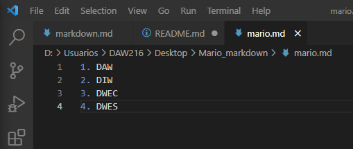

Comando para clonar:
`git clone git@github.com:DAM119MarioP/Mario_markdown.git`
Imagenes del ejercicio E:

Comando usado en el ejercicio E:
`git push`
Imagen del ejercicio F:

Imagenes del ejercicio I:

Imagen del ejercicio J:

Comando usado en el ejercicio J:
`git tag v0.1`
`git show v0.1`

Imagenes del ejercicio K:

Comando usado en el ejercicio K:
`git status`
`git add [nombre de los archivos]`
`git pull`
`git commit -m "Texto"`
`git push`

| Vanessa | Luis |
| -------- | -------- |
| https://github.com/VanessaSantosPuente/Vanessa_markdown | https://github.com/DAW201/Luis_Concha_MARKDOWN |

Documentar todo lo hecho:

`git branch nombreRama`
`git checkout nombreRama`
`git push origin nombreRama` 
`git checkout main`
Borrar la rama
`git branch -d nombreRama`
`git merge nombreRama` Desde la main
 